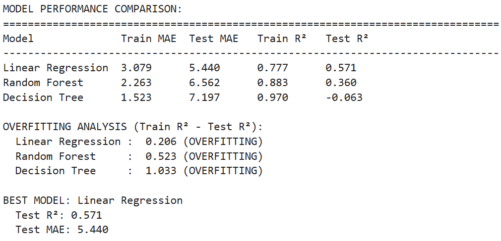

# Predicting Provincial Voter Turnout Percentages in the 2025 Philippine Elections Using Linear Regression

A machine learning project that predicts provincial voter turnout percentages in the 2025 Philippine Elections using Linear Regression analysis.

## Table of Contents

- [Project Overview](#project-overview)
- [Dataset](#dataset)
- [Methodology](#methodology)
- [Key Features](#key-features)
- [Usage](#usage)
- [Results](#results)
- [Visualizations](#visualizations)
- [Model Performance](#model-performance)
- [Key Findings](#key-findings)
- [Challenges](#challenges)
- [Future Improvements](#future-improvements)
- [Installation](#installation)
- [References](#references)

## Project Overview

This project explores the use of machine learning techniques for discovering patterns and predicting voter turnout outcomes using real-world Philippine election data. The analysis focuses on understanding what factors influence voter participation across different provinces in the Philippines.

### Objectives

- Apply the CRISP-DM methodology for data mining projects.
- Use Python and scikit-learn to clean, preprocess, and analyze election data.
- Develop predictive models to understand voter participation patterns.
- Evaluate model performance using standard regression metrics (R², MAE, RMSE).
- Provide actionable insights for COMELEC election planning and voter education campaigns.

## Dataset

**Dataset Title:** Philippine Elections 2025 Voter Turnout  
**Source:** [COMELEC via Kaggle](https://www.kaggle.com/datasets/bwandowando/philippine-elections-2025-voter-turnout?select=province_metadata.csv)  
**Format:** CSV  
**Size:** 125 provinces, 11 features  
**Target Variable:** `voter_percentage` (voter turnout percentage)

### Dataset Features

| Feature | Description | Type |
|---------|-------------|------|
| `province_id` | Unique identifier for each province | Integer |
| `location_name` | Province name | String |
| `type` | Location type (Province) | String |
| `slug` | URL-friendly province identifier | String |
| `precinct_count` | Number of reporting precincts | Integer |
| `precinct_total` | Total number of precincts | Integer |
| `precinct_percentage` | Percentage of precincts reporting | Float |
| `voter_count` | Number of votes cast | Integer |
| `voter_total` | Total registered voters | Integer |
| `voter_percentage` | Voter turnout percentage (TARGET) | Float |
| `timestamp` | Data timestamp | String |

### Target Variable Statistics

- **Range:** 7.19% - 91.13%
- **Mean:** 80.14%
- **Median:** 83.28%
- **Standard Deviation:** 12.98%

## Methodology

This project follows the **CRISP-DM** (Cross-Industry Standard Process for Data Mining) methodology:

1. **Data Understanding** - Exploratory Data Analysis (EDA) to understand voter turnout patterns
2. **Data Preparation** - Feature selection, scaling, and train-test split
3. **Modeling** - Implementation and comparison of multiple algorithms (Linear Regression, Random Forest, Decision Tree)
4. **Evaluation** - Model selection based on performance metrics
5. **Deployment** - Model export and documentation

## Key Features

- **Feature Selection** - based on correlation analysis with voter turnout
- **Models Used** - Linear Regression, Random Forest, and Decision Tree comparison
- **Comprehensive Evaluation** - R², MAE, and RMSE metrics with overfitting analysis
- **Visualization** - set of plots for data exploration and model evaluation
- Trained models saved in multiple formats for deployment

## Results

### Model Performance Comparison

| Model | Train R² | Test R² | Train MAE | Test MAE | Overfitting |
|-------|----------|---------|-----------|----------|-------------|
| **Linear Regression** | 0.777 | **0.571** | 3.079 | **5.440** | Low |
| Random Forest | 0.883 | 0.360 | 2.263 | 6.562 | High |
| Decision Tree | 0.970 | -0.063 | 1.523 | 7.197 | Very High |

### Best Model: Linear Regression

- **R² Score:** 0.571 (Explains 57.1% of variance)
- **MAE:** 5.44 percentage points
- **RMSE:** 8.61 percentage points
- **Generalization:** Good (minimal overfitting)

## Visualizations

### Data Distribution and Patterns


*Shows how voter turnout is distributed across all provinces*

- Voter turnout is strong nationwide, with the majority of provinces clustering around 80–90% turnout
- A small number of provinces have poor voter turnout (below than 30%), most likely due to logistical difficulties in offshore voting locations
- For the majority of provinces, the concentration of 75–90% indicates dependable model performance
- Although they only make up a small percentage of the data, extremely low numbers may cast doubt on the correctness of the model


*Relationship between province size and voter participation*

- Province size doesn't determine turnout — large and small provinces show similar participation rates
- Most provinces maintain 75-90% turnout regardless of population size
- Low turnout areas appear across all population sizes, likely overseas voting regions
- Total voters alone is a weak predictor, justifying the use of additional features in the model


*Impact of complete precinct reporting on voter turnout measurement*

- Voter turnout is consistently greater in provinces with 100% comprehensive precinct reporting, suggesting that improved electoral organization increases participation
- The majority of provinces demonstrated efficient election management across the country by achieving 100% precinct reporting with turnout ranging from 75% to 90%
- Voter participation is inversely correlated with lower precinct reporting rates, indicating that logistical issues influence both indicators at the same time
- Precinct_percentage is confirmed to be the strongest feature (0.334 correlation) in the prediction model by this relationship

### Top Performing Provinces


*Provinces with highest voter engagement rates*

- The top ranks are dominated by mountain and island provinces (Abra, Siquijor, and Camiguin), indicating that civic involvement is higher in remote and smaller areas
- The turnout in all ten of the best provinces was between 88 and 91 percent, which is much higher than the national average for democratic involvement
- The list demonstrates national engagement by include provinces from Mindanao (Davao de Oro, Surigao del Norte), Visayas (Siquijor, Camiguin), and Luzon (Abra, Ilocos)
- Abra leads with a 91.13% turnout percentage, making these provinces models for successful elections

### Feature Analysis


*Correlation analysis between numeric variables*

- Precinct_percentage is the most useful variable for prediction because it has the best correlation (0.334) with voter turnout
- There is a strong correlation (0.98+) between voter and precinct-related variables, suggesting possible multicollinearity problems
- The majority of features exhibit weak to moderate correlations with voter turnout (0.125-0.334), indicating that numerous features are necessary for modeling
- Precinct-related variables are important predictors, and the correlation analysis shows that the features we chose are the most pertinent

### Model Evaluation



*Comparison of all three models across different metrics*

- The decision tree exhibits extreme overfitting, failing totally on test data (R2 ≈ 0) but demonstrating perfect training fit (R2 = 0.97)
- Random Forest strikes the optimum balance between good generalization and strong training performance
- While Linear Regression performs consistently across both sets, Decision Tree exhibits classic overfitting, as evidenced by the sharp difference between training and test metrics (MAE leaps from 1.7 to 7.2)


*Detailed visualization of model performance including actual vs predicted plots*

- Linear Regression shows best generalization (smallest gap between train/test)
- Random Forest and Decision Tree are overfitting
- Actual vs Predicted plot shows model accuracy
- Residual plot shows prediction errors

## Model Performance

### Selected Features (Based on Correlation Analysis)

1. **precinct_percentage** (0.334 correlation) - Strongest predictor
2. **precinct_count** (0.232 correlation)
3. **precinct_total** (0.220 correlation)
4. **voter_count** (0.219 correlation)
5. **voter_total** (0.125 correlation)

### Sample Predictions

| Province | Actual | Predicted | Error |
|----------|--------|-----------|-------|
| Zamboanga del Sur | 84.58% | 85.05% | 0.47% |
| La Union | 87.66% | 88.31% | 0.65% |
| City of Marikina | 81.80% | 81.70% | 0.10% |
| Rizal | 76.30% | 55.47% | 20.83% |
| Laguna | 79.43% | 62.80% | 16.62% |

## Key Findings

### Geographic Patterns
- **Highest turnout** Mountain provinces (Abra 91.13%, Siquijor 90.57%, Camiguin 89.84%)
- **Lowest turnout** Overseas voting regions (7-24% range)
- **National average** ~80% voter participation

### Important Trends
- Precinct organization strongly correlates with higher turnout
- Complete precinct reporting (100%) typically indicates higher participation
- Province size doesn't determine turnout rates
- Urban vs rural differences exist but aren't consistently predictive

### Business Insights
- Model can identify provinces needing voter education campaigns
- Precinct infrastructure investment could improve participation
- Resource allocation can be optimized based on predicted turnout

## Challenges

1. **Limited dataset size** - Only 125 provinces restricts model complexity
2. **Feature limitations** - Missing demographic and socioeconomic variables
3. **Overseas voting** - Significantly different patterns from domestic voting
4. **Overfitting** - Complex models (Decision Tree, Random Forest) overfit on small dataset
5. **Prediction accuracy** - Some provinces (Rizal, Laguna) harder to predict accurately

## Future Improvements

- **Expand features** - Include demographic, geographic, and economic data
- **Historical data** - Incorporate previous election results for trend analysis
- **Granular data** - Add city/municipality-level data for more training instances
- **Feature engineering** - Create urban/rural classifications, population density metrics
- **Advanced models** - Explore ensemble methods with regularization
- **Real-time updates** - Implement system for live election monitoring

## Installation

## Project Structure

```
ph-election-2025-voter-turnout-prediction/
├── dataset/
│   ├── .ipynb_checkpoints/
│   └── province_metadata.csv
├── notebook/
│   ├── salvador-ph-election-2025-voter-turnout-prediction.html
│   └── salvador-ph-election-2025-voter-turnout-prediction.ipynb
├── philippine_elections_model/
│   ├── feature_scaler.pkl
│   ├── linear_regression_model.joblib
│   ├── linear_regression_model.pkl
│   ├── model_results.json
│   └── test_predictions.csv
├── visualization/
└── README.md
```

### Prerequisites

- Python 3.8 or higher
- Jupyter Notebook

### Required Libraries

```bash
pip install pandas numpy matplotlib seaborn scikit-learn
```

### Clone Repository

```bash
git clone https://github.com/ludreinsalvador/ph-election-2025-voter-turnout-prediction.git
cd ph-election-2025-voter-turnout-prediction
```

## Usage

### Running the Analysis

1. **Launch Jupyter Notebook:**
   ```bash
   jupyter notebook
   ```

2. **Open the main notebook:**
   ```
   salvador-ph-election-2025-voter-turnout-prediction.ipynb
   ```

3. **Run all cells** to reproduce the complete analysis

### Using the Trained Model

```python
import pickle
import joblib

# Load the trained model
model = joblib.load('philippine_elections_model/linear_regression_model.joblib')
scaler = pickle.load(open('philippine_elections_model/feature_scaler.pkl', 'rb'))

# Make predictions (example)
# features = [precinct_percentage, precinct_count, precinct_total, voter_count, voter_total]
# scaled_features = scaler.transform([features])
# prediction = model.predict(scaled_features)
```

## References

- ABS-CBN. (2022). *Halalan 2022 Philippine Election Results | ABS-CBN News*. ABS-CBN News. https://halalanresults.abs-cbn.com/
- BwandoWando. (2025). *🇵🇭 Philippine Elections 2025 Voter Turnout*. Kaggle.com. https://www.kaggle.com/datasets/bwandowando/philippine-elections-2025-voter-turnout?select=province_metadata.csv
- Data Science PM. (2024, December 9). *What Is CRISP DM? Data Science Project Management*. https://www.datascience-pm.com/crisp-dm-2/
- Kaggle. (2025). *Learn Python, Data Viz, Pandas & More | Tutorials | Kaggle*. Www.kaggle.com. https://www.kaggle.com/learn
- Risk, B. (2025, June 9). *Philippine Elections 2025 Voter Turnout Analysis*. Kaggle.com; Kaggle. https://www.kaggle.com/code/devraai/philippine-elections-2025-voter-turnout-analysis
- Scikit-learn. (2024). *scikit-learn: Machine Learning in Python*. Scikit-Learn.org. https://scikit-learn.org/stable/

---

*This project demonstrates the application of machine learning techniques in political science and election analysis, contributing to better understanding of voter behavior patterns in the Philippines.*


